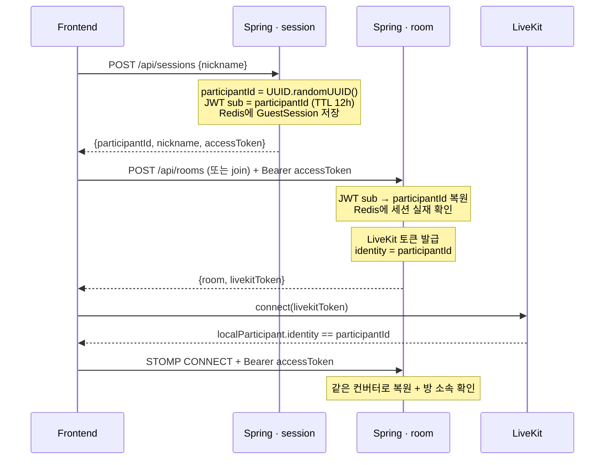

# 참가자 식별자(participantId) 흐름

> 회원가입이 없는 서비스라 "이 사람이 누구인가"를 정하는 유일한 축이 **게스트 세션이 발급한
> `participantId`(UUID)** 다. 이 값 하나가 REST 인증 주체 · STOMP 인증 주체 · LiveKit
> identity · 게임 로직의 플레이어 키를 **전부 겸한다.** 그래서 어디서도 별도 ID를 새로 만들지
> 않는다.

## 한눈에



핵심은 마지막에서 두 번째 줄이다 — **프론트는 자기 ID를 만들지 않고, 서버가 서명한 LiveKit
토큰에 실려 돌아온 값을 되받는다.**

## 1. 발급 — `POST /api/sessions`

[SessionService.java:32](../backend/src/main/java/com/camon/domain/session/service/SessionService.java#L32)

```java
UUID participantId = UUID.randomUUID();
GuestSession session = new GuestSession(participantId, request.nickname(), createdAt);
IssuedAccessToken accessToken = jwtTokenProvider.issueAccessToken(participantId);
sessionRepository.save(session, accessToken.expiresAt());
```

`issueAccessToken`은 **`sub` 클레임에 `participantId`를 그대로 넣는다**
([JwtTokenProvider.java:61-75](../backend/src/main/java/com/camon/global/security/jwt/JwtTokenProvider.java#L61-L75)).
issuer `camon-backend`, audience `camon-services`, TTL 12시간(`application.yml`의 `access-token-ttl`).

응답은 [CreateSessionResponse](../backend/src/main/java/com/camon/domain/session/dto/CreateSessionResponse.java) —
`participantId`, `nickname`, `accessToken` 세 개다. 이 엔드포인트만
[SecurityConfig.java:31](../backend/src/main/java/com/camon/global/config/SecurityConfig.java#L31)에서
`permitAll`이다(아직 토큰이 없는 유일한 시점이라).

**닉네임은 식별자가 아니다.** 방 안에서만 유일하면 되고 중복 시 재입력을 요구할 뿐,
사람을 가리키는 건 언제나 `participantId`다.

## 2. 저장 — 프론트 sessionStorage

[enterRoom.ts](../frontend/src/features/room/lib/enterRoom.ts)가 **세션 발급과 방 입장을 한
덩어리로** 처리한다. 닉네임만 넣고 방에 못 들어간 "떠 있는 세션"이 남지 않게 하려는 것이다:

```ts
const session = await createSession(nickname);
try {
  result = mode === 'create'
    ? await roomApi.createRoom(maxPlayers, session.accessToken)
    : await roomApi.joinRoom(roomCode, session.accessToken);
} catch (error) {
  clearSession();   // 입장 실패 → 방금 받은 세션은 쓸 데가 없다
  throw error;
}
saveSession(session);                                        // 입장 확정 후에만 저장
saveRoom({ roomId: result.room.roomId, livekitToken: result.livekitToken });
```

저장소는 `sessionStorage`(키 `camon.session`)다 —
[sessionStorage.ts](../frontend/src/features/session/lib/sessionStorage.ts). 탭을 닫으면
사라지는 게 맞다고 본 이유는 회원가입 없는 임시 세션이라 영구 보관할 근거가 없어서다.

## 3. 복원 — REST와 WS가 같은 컨버터를 공유

### REST

[GuestJwtAuthenticationConverter.java](../backend/src/main/java/com/camon/global/security/GuestJwtAuthenticationConverter.java)가
매 요청마다 두 가지를 한다:

1. `UUID.fromString(jwt.getSubject())` — 형식이 UUID가 아니면 `BadCredentialsException`
2. `sessionRepository.findByParticipantId(...)` — **Redis에 세션이 실제로 살아 있는지 확인**

2번이 중요하다. 서명만 맞으면 통과시키는 게 아니라 서버가 아는 세션인지까지 본다. 방이 종료돼
세션이 지워졌거나 TTL이 지난 토큰은 서명이 멀쩡해도 거절된다.

결과는 [GuestPrincipal](../backend/src/main/java/com/camon/global/security/GuestPrincipal.java)
(`record GuestPrincipal(UUID participantId)`)이고, 컨트롤러는 이걸로 `participantId`를 받는다.

### WebSocket(STOMP)

[StompAuthenticationInterceptor.java](../backend/src/main/java/com/camon/global/ws/StompAuthenticationInterceptor.java)가
`CONNECT` 시점에 **같은 컨버터를 재사용**하고, 여기에 한 겹을 더 얹는다:

```java
if (participantRepository.findById(roomId, principal.participantId()).isEmpty()) {
    throw new AccessDeniedException("Participant does not belong to room");
}
accessor.setUser(authentication);
connectionService.connected(roomId, principal.participantId(), accessor.getSessionId());
```

- **방 소속 확인** — 유효한 토큰이라도 그 방의 참가자가 아니면 구독 자체를 막는다
- **STOMP 세션 id까지 같이 넘긴다** — 프론트가 참가자당 연결을 여러 개(로비/하트비트/코스/게임별)
  열기 때문에, 마지막 하나가 끊길 때만 "연결 끊김"으로 처리하려면 참가자별 살아있는 연결 수를
  세야 한다

## 4. LiveKit identity로 되돌아옴 — 여기가 연결 고리

방 생성/입장 응답에 LiveKit 토큰이 함께 실린다
([RoomService.java:186](../backend/src/main/java/com/camon/domain/room/service/RoomService.java#L186),
[RoomService.java:331](../backend/src/main/java/com/camon/domain/room/service/RoomService.java#L331)):

```java
liveKitTokenService.createRoomJoinToken(room.roomId(), participant.participantId(), nickname)
```

[LiveKitTokenService.java:28](../backend/src/main/java/com/camon/domain/media/service/LiveKitTokenService.java#L28):

```java
token.setIdentity(participantId.toString());   // ← identity = participantId
token.setName(nickname);
token.addGrants(new RoomJoin(true), new RoomName(roomId.toString()));
```

**LiveKit identity를 서버가 `participantId`로 박아서 서명한다.** 그래서 프론트는 로컬 상태를
따로 들 필요 없이 LiveKit에서 자기 ID를 읽으면 된다:

```ts
const myId = localParticipant.identity || null;   // NinjaBattleScreen.tsx:88
```

같은 규약을 대기방도 쓴다 —
[LobbyScreen.tsx:127](../frontend/src/features/room/components/LobbyScreen.tsx#L127)의
`// 타일 테두리·표시에 쓸 참가자 정보 (LiveKit identity == participantId)`.

이 설계 덕분에 **캠 타일과 게임 상태를 같은 키로 맞출 수 있다.** 서버가 내려주는
`alivePlayers`, `attackerToken`, 랭킹의 `participantId`를 그대로 LiveKit 참가자에 대응시켜
"공격당한 사람의 캠에 이펙트"가 성립한다.

## 5. 게임 로직에서의 사용 (닌자 예시)

닌자 REST는 전부 `Authorization: Bearer ${accessToken}`으로만 나간다 —
**요청 바디에 "나는 누구다"를 안 싣는다**
([ninjaApi.ts:171](../frontend/src/features/ninja/api/ninjaApi.ts#L171)). 서버가 토큰에서
`participantId`를 꺼내 쓰므로 남을 사칭할 수 없다.

프론트에서 내 것인지 판정하는 자리도 전부 이 값 하나로 비교한다
([useNinjaRound.ts:307](../frontend/src/features/ninja/hooks/useNinjaRound.ts#L307)):

```ts
if (!participantId || round == null || exchange == null || currentAttackerToken !== participantId) return;
```

이 비교가 **회귀 감지기 역할**을 한다. 서버가 내려주는 토큰과 LiveKit identity가 서로 다른 ID
공간이 되는 순간 이 조건이 항상 거짓이 되어 공격권·타깃 지정 UI가 통째로 안 뜬다. 조용히
틀리는 게 아니라 눈에 띄게 죽는다.

## 6. 수명과 종료

| 사건 | 결과 |
| --- | --- |
| TTL 12시간 경과 | 토큰 만료 → 401 |
| 방 종료 / 강퇴 | Redis 세션·참가자 삭제 → 컨버터 2단계에서 거절 |
| 백엔드 재시작 | **JWT 서명키가 새로 생성돼 발급된 모든 토큰이 한꺼번에 무효** |

세 번째는 `local` 프로파일에서만 생기는 현상인데, 지금은 배포 환경도 `local`로 뜬다
([S15P11B110-110](https://ssafy.atlassian.net/browse/S15P11B110-110),
[8-3 로그](../ham_log/8-3_배포프로파일-local-탈출-ddl-auto-JWT키.md) 참고).

어느 경우든 프론트 처리는 하나로 모인다 —
[sessionExpiry.ts](../frontend/src/features/session/lib/sessionExpiry.ts):

- `isSessionDead(status)` = `status === 401`
- `handleExpiredSession()` → `clearSession()` + `clearRoom()` + `window.location.replace('/')`
- 여러 STOMP 연결이 동시에 실패하므로 `handled` 플래그로 **한 번만** 처리
- `location.replace`를 쓰는 이유: 죽은 토큰을 쥔 훅들이 전부 정리돼야 재연결 루프가 멈추는데,
  React Router 밖(api 모듈·STOMP 콜백)이라 `navigate`를 쓸 수 없다

이 처리가 없던 시절엔 REST는 원인 불명 에러만 남기고 STOMP는 죽은 토큰으로 3초마다 영원히
재연결을 시도해서, 사용자가 스스로 빠져나갈 방법이 없었다. 회원가입이 없으니 복구는 "닉네임
다시 입력"으로 끝난다.

## 설계 요약

- **ID를 만드는 곳은 한 군데** — `SessionService`. 프론트도, 게임 도메인도, LiveKit도 만들지 않는다
- **프론트는 자기 ID를 주장하지 않는다** — 서버가 서명한 토큰(JWT·LiveKit)에서 되받기만 한다.
  요청 바디에 참가자 ID를 싣는 API가 없다
- **인증 판정은 REST/WS가 같은 코드를 공유** — `GuestJwtAuthenticationConverter`. WS는 방 소속
  검사만 추가로 얹는다
- **한때 프론트가 임시 UUID를 만들던 시절이 있었다** — `frontend/src/.../participantId.ts`.
  세션/대기방 도메인이 없던 때의 임시방편이었고 커밋 `6812183`에서 제거됐다
  ([S15P11B110-112](https://ssafy.atlassian.net/browse/S15P11B110-112))
